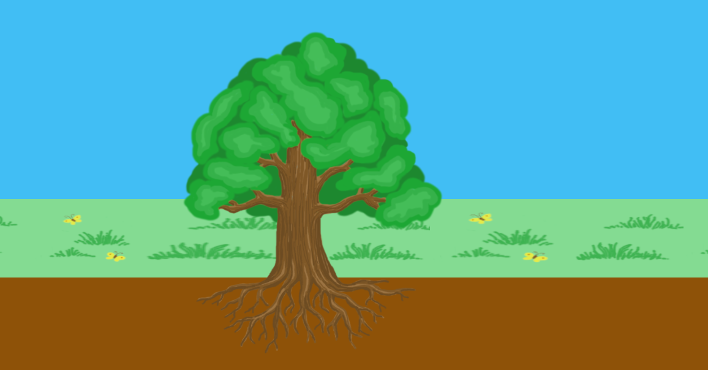

# Rooted journey

"Rooted Journey" is an exciting new game that puts players in control of roots as they navigate through a map of obstacles to reach the water at the end. With challenging terrain and obstacles to overcome, players will need to use strategy and skill to guide their roots to their ultimate goal. The game combines elements of adventure, strategy, and puzzle-solving to create an unforgettable experience. Whether you're looking for a fun way to pass the time or a challenging new game to master, "Rooted Journey" is the perfect choice.

Created on the Global Game Jam 2023: https://globalgamejam.org/2023/games/rooted-journey-2

Play it: https://rootedjourney.de
